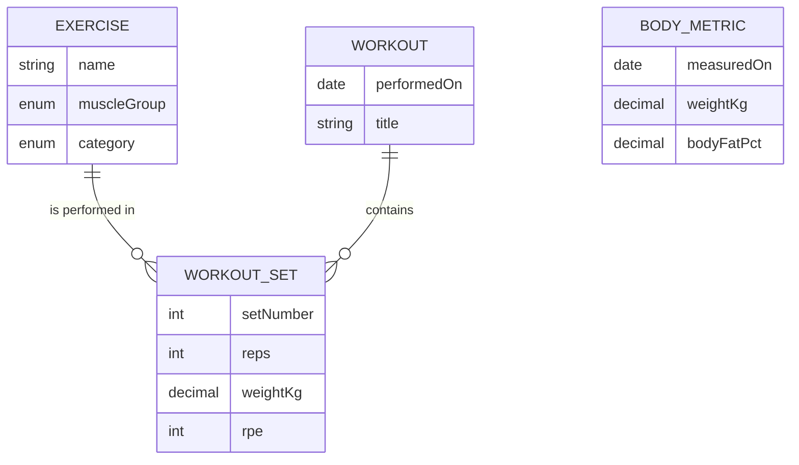
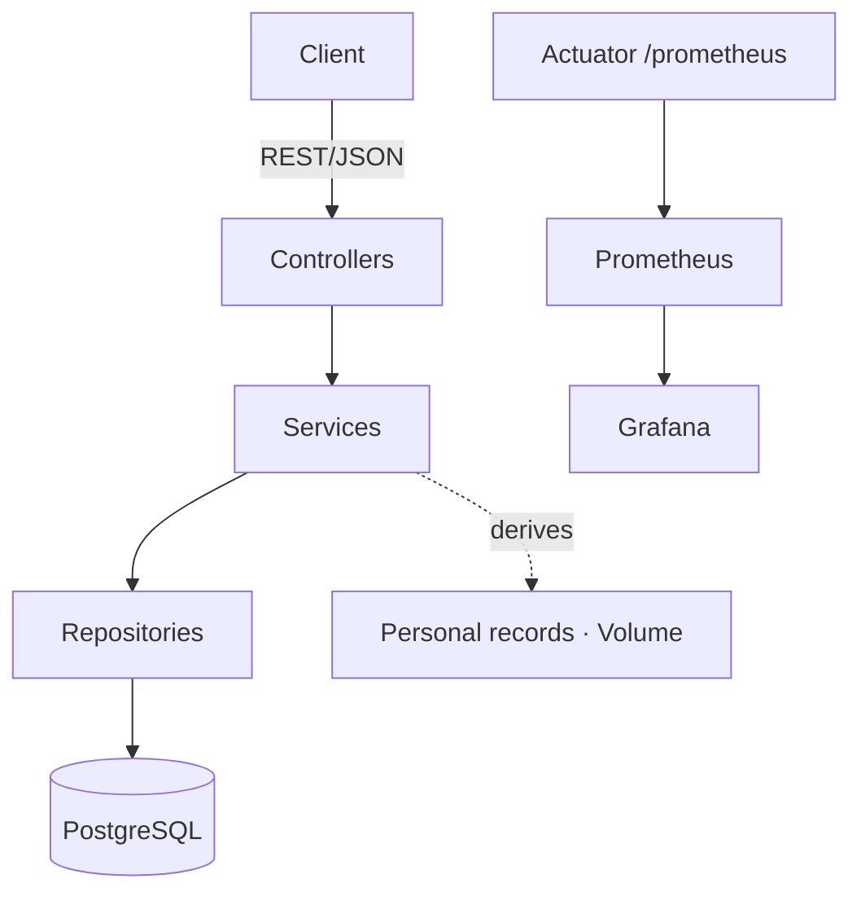

# fittrack-api

[](https://github.com/erikschwob/fittrack-api/actions/workflows/ci.yml)
[](https://openjdk.org/projects/jdk/17/)
[](https://spring.io/projects/spring-boot)
[](#testing)
[](LICENSE)

A strength-training tracker REST API — and a worked example of taking a Spring
Boot service the whole way down the DevOps chain: **containerised → CI → Kubernetes
→ observability**.

You log workouts and the sets within them; the API derives the analytics that
actually matter for progressive overload: estimated one-rep-max **personal records**
and **training volume per muscle group**.

> Built to consolidate and demonstrate a backend + DevOps skill set on a stack I
> work with daily (Java 17, Spring Boot, PostgreSQL, Flyway, Docker). The companion
> project [`fittrack-analytics`](https://github.com/erikschwob/fittrack-analytics)
> consumes the data this API produces and turns it into an analytics pipeline.

---

## Table of contents

- [What this demonstrates](#what-this-demonstrates)
- [Domain model](#domain-model)
- [Architecture](#architecture)
- [Tech stack](#tech-stack)
- [Quick start](#quick-start)
- [API overview](#api-overview)
- [The stats, explained](#the-stats-explained)
- [Running tests](#testing)
- [Kubernetes](#kubernetes)
- [Observability](#observability)
- [Roadmap](#roadmap)
- [Known limitations](#known-limitations)
- [AI engineering note](#ai-engineering-note)

---

## What this demonstrates

| Area | How |
|------|-----|
| **Backend** | Spring Boot 3, layered architecture (controller → service → repository), DTO boundary, bean validation, RFC 7807 error responses |
| **Persistence** | JPA/Hibernate, **Flyway** versioned migrations, fetch-join queries (no `open-in-view` crutch), portable SQL that runs on PostgreSQL *and* H2 |
| **API design** | REST, OpenAPI/Swagger UI, sensible status codes (201/204/400/404/409) |
| **Testing** | JUnit 5, MockMvc integration tests against H2, JaCoCo coverage gate (≥ 50 %, currently 83 %) |
| **CI/CD** | GitHub Actions: build, test, coverage, and a Docker image build |
| **Containers** | Multi-stage Dockerfile (non-root, container-aware JVM, healthcheck), one-command `docker compose` stack |
| **Kubernetes** | Deployment/Service/ConfigMap/Secret/Ingress, liveness & readiness probes, resource limits ([`k8s/`](k8s/)) |
| **Observability** | Micrometer → Prometheus metrics, provisioned Grafana dashboard ([`monitoring/`](monitoring/)) |

---

## Domain model



A **workout** is a training session on a day; it owns its **sets**. Each set
references an **exercise** from a controlled catalogue and records reps, load and
optionally RPE (rate of perceived exertion). **Body metrics** are tracked
separately so strength progress can be read against bodyweight.

---

## Architecture



Layering is strict: controllers speak DTOs only, services hold the transactional
boundary and business rules, repositories are the only thing that touches the DB.

---

## Tech stack

Java 17 · Spring Boot 3.2 · Spring Data JPA · Flyway · PostgreSQL 16 · springdoc
OpenAPI · Micrometer/Prometheus · JUnit 5 + AssertJ · JaCoCo · Docker · Kubernetes
· Grafana.

---

## Quick start

The only prerequisite is Docker — no local JDK or Maven needed.

```bash
docker compose up --build
```

Then:

- API base: <http://localhost:18080>
- Swagger UI: <http://localhost:18080/swagger-ui.html>
- Health: <http://localhost:18080/actuator/health>

The database is seeded with a starter catalogue of ~14 common lifts, so the API
is usable immediately.

> Host ports are offset (`18080`, `15432`) to avoid clashing with anything already
> running on the usual `8080`/`5432`.

---

## API overview

| Method | Path | Description |
|--------|------|-------------|
| `GET`    | `/api/exercises` | List exercises (optional `?muscleGroup=`) |
| `GET`    | `/api/exercises/{id}` | Get one exercise |
| `POST`   | `/api/exercises` | Create an exercise |
| `GET`    | `/api/workouts` | List workouts (optional `?from=&to=`) |
| `GET`    | `/api/workouts/{id}` | Get a workout with all its sets |
| `POST`   | `/api/workouts` | Create a workout |
| `DELETE` | `/api/workouts/{id}` | Delete a workout and its sets |
| `POST`   | `/api/workouts/{id}/sets` | Append a set (set number auto-assigned) |
| `GET`    | `/api/stats/personal-records` | Best estimated 1RM per strength exercise |
| `GET`    | `/api/stats/volume?from=&to=` | Training volume per muscle group |
| `GET`    | `/api/body-metrics` | List body metrics |
| `POST`   | `/api/body-metrics` | Record a body metric (one per day) |

### End-to-end example

```bash
B=http://localhost:18080

# Create a workout
WID=$(curl -s -X POST $B/api/workouts -H 'Content-Type: application/json' \
  -d '{"performedOn":"2026-06-08","title":"Push Day"}' | jq .id)

# Log two bench sets (Bench Press is exercise #5 from the seed catalogue)
curl -s -X POST $B/api/workouts/$WID/sets -H 'Content-Type: application/json' \
  -d '{"exerciseId":5,"reps":5,"weightKg":80.0,"rpe":8}'
curl -s -X POST $B/api/workouts/$WID/sets -H 'Content-Type: application/json' \
  -d '{"exerciseId":5,"reps":3,"weightKg":92.5,"rpe":9}'

# Personal record (best estimated 1RM): 92.5 kg × 3 → 101.75 kg
curl -s $B/api/stats/personal-records
```

---

## The stats, explained

**Estimated one-rep max** uses the **Epley formula**:

$$ 1\text{RM} \approx w \cdot \left(1 + \frac{r}{30}\right) $$

where `w` is the load and `r` the reps. It lets a heavy triple and a lighter set
of ten be compared on one scale, so a personal record reflects genuine strength
rather than just the heaviest number logged. Only `STRENGTH` exercises are ranked.

**Training volume** is `Σ (weight × reps)` over a date range, grouped by muscle
group — the standard proxy for how much work a muscle group absorbed. This
aggregate is pushed down to SQL; the 1RM ranking is computed in Java because the
Epley formula is awkward to express portably in JPQL.

---

## Testing

```bash
./mvnw verify        # runs tests + JaCoCo coverage gate
```

- **Unit tests** — the Epley/volume maths on `WorkoutSet`.
- **Integration tests** — full Spring context via MockMvc against an in-memory H2
  running the *real* Flyway migrations (H2 in PostgreSQL-compatibility mode), so
  the schema and queries are exercised exactly as in production.
- A JaCoCo rule fails the build below 50 % line coverage (currently **83 %**).

No Docker or external DB is needed for the test suite.

---

## Kubernetes

Manifests and a kind/minikube walkthrough are in [`k8s/`](k8s/). Highlights:
two app replicas, Actuator-backed liveness/readiness probes, resource requests/limits,
config split across `ConfigMap` (non-secret) and `Secret` (credentials). Validate
them without a cluster:

```bash
docker run --rm -v "$PWD/k8s":/m ghcr.io/yannh/kubeconform:latest -strict -summary /m
```

## Observability

[`monitoring/`](monitoring/) brings up the API plus Prometheus and Grafana:

```bash
cd monitoring && docker compose up --build
# Grafana → http://localhost:13000  (admin/admin), dashboard auto-provisioned
```

The app exposes Micrometer metrics at `/actuator/prometheus`; the provisioned
Grafana dashboard charts request rate, p95 latency, responses by status, JVM heap,
CPU, DB pool usage and uptime.

---

## Roadmap

- [x] Core domain + REST API + OpenAPI
- [x] Flyway migrations, portable across PostgreSQL/H2
- [x] Dockerfile + compose, GitHub Actions CI with coverage gate
- [x] Kubernetes manifests with probes
- [x] Prometheus + Grafana dashboard
- [ ] Authentication (Spring Security + JWT) and per-user data isolation
- [ ] Helm chart packaging the k8s manifests
- [ ] Pagination on list endpoints
- [ ] 1RM progression endpoint (time series per exercise)

---

## Known limitations

- **Single-user.** There is no auth or per-user scoping yet — every workout is
  global. This is the next roadmap item.
- **Demo credentials.** The compose/k8s database passwords are placeholders, not
  secrets management.
- **No pagination.** List endpoints return everything; fine at demo scale.

These are deliberate, documented scope cuts — not oversights.

---

## AI engineering note

Built with AI pair-programming assistance for implementation speed. The domain
modelling, architecture decisions and the choice of which DevOps stages to
demonstrate are my own.

## License

MIT — see [LICENSE](LICENSE).
